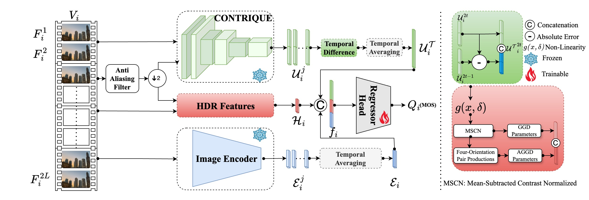

# BrightRate: Quality Assessment for User-Generated HDR Videos

**Authors:** Shreshth Saini<sup>1</sup>, Bowen Chen<sup>1</sup>, Yilin Wang<sup>1</sup>, Neil Birkbeck<sup>2</sup>, Balu Adsumilli<sup>2</sup>, Alan C. Bovik<sup>1</sup>  
**Affiliations:** <sup>1</sup>UT Austin, <sup>2</sup>Google  
**Conference:** Proceedings of the IEEE/CVF Winter Conference on Applications of Computer Vision (WACV), March 2026


<!-- Will update these links after receiving the decision>  -->

[](https://creativecommons.org/licenses/by-nc/4.0/) [](https://openaccess.thecvf.com/content/WACV2026/papers/Saini_BrightRate_Quality_Assessment_for_User-Generated_HDR_Videos_WACV_2026_paper.pdf) [](https://openaccess.thecvf.com/content/WACV2026/supplemental/Saini_BrightRate_Quality_Assessment_WACV_2026_supplemental.zip) [](https://github.com/shreshthsaini/BrightVQ) \
[](https://ieeexplore.ieee.org/document/YOUR_PAPER_ID)


## 📌 Overview

_**BrightVQ**_ is the a large-scale subjective video quality dataset dedicated to **HDR User-Generate-Content (UGC)** video quality assessment.  It consists of **300 HDR source videos** and **2,100 transcoded versions**, with **73,794 subjective quality ratings** collected through crowd-sourced subjective study. _**BrightVQ**_ serves as a benchmark for **No-Reference (NR) UGC HDR-VQA models**.

<p align="center">
  
</p>

Based on _**BrightVQ**_, we introduce _**BrightRate**_, a novel No-Reference (NR) Video Quality Assessment (VQA) model designed to capture **UGC-specific distortions** and **HDR-specific artifacts**. 

_**BrightRate**_ integrates **UGC-specific features** from a pretrained CONTRIQUE model， **semantic cues** from a CLIP-based encoder, 
**HDR features** extracted via a piecewise non-linear luminance transform, and **temporal differences**, which are regressed to MOS. 

<p align="center">
  
</p>

<!-- ### **Key Features**
✅ **5,992 videos** from **856 UGC-HDR reference videos**  
✅ **Authentic UGC-HDR distortions**, including compression artifacts  
✅ **Bitrate ladder encoding**, simulating real-world streaming scenarios  
✅ **211,848 subjective ratings** collected via **Amazon Mechanical Turk (AMT)**  
✅ **Balanced mix of portrait and landscape videos**  

This dataset serves as a benchmark for **No-Reference (NR) UGC HDR-VQA models** and HDR quality assessment research. -->

---

## 📊 Performance Comparison (SROCC)

| **Dataset**  | **CONTRIQUE** | **DOVER** | **FastVQA** | **HIDROVQA** | **BrightRate** |
|:------------:|:--------:|:--------:|:---------:|:---------:|:--------------:|
| **BrightVQ**  | 0.7081  | 0.7745  | 0.8094   | 0.8526   | <span style="color:blue"><b>0.8887</b></span> |
| **LIVE-HDR**  | 0.8170  | 0.6303  | 0.5182   | 0.8793   | <span style="color:blue;"><b>0.8907</b></span> |
| **SFV+HDR**   | 0.5901  | 0.6001  | 0.7130   | 0.7003   | <span style="color:blue;"><b>0.7328</b></span> |

<!-- <p align="center">
  
</p> -->

---
## ✨ Run BrightRate

Please follow --> Demo_Inference

---

##  ⬇️ Downloading our BrightVQ Dataset

### 🔗 Downloading the entire dataset

Direct download link for dataset: **COMING SOON**

### 🔗 Accessing dataset videos

#### **1️⃣ Directly from AWS S3 (via Browser)**
Each video is hosted on AWS S3 and can be accessed using:

    wget https://ugchdrmturk.s3.us-east-2.amazonaws.com/videos/VIDEO.mp4 

Replace `VIDEO` with a hashed video ID from `BrightVQ.csv` or `BrightVQ.txt`.

Example:  
Police: [https://ugchdrmturk.s3.us-east-2.amazonaws.com/videos/ad8affdd94b3c44ae83169fb668ea5c6.mp4](https://ugchdrmturk.s3.us-east-2.amazonaws.com/videos/ad8affdd94b3c44ae83169fb668ea5c6.mp4)

#### **2️⃣ Downloading Videos Using AWS CLI**
To download all videos:
```sh
cat BrightVQ.txt | while read video; do
    aws s3 cp s3://ugchdrmturk/videos/${video}.mp4 ./BrightVQ/
done
```

To download a single video:
```sh
aws s3 cp s3://ugchdrmturk/videos/VIDEO.mp4 ./BrightVQ/
```

To download selected videos, create a new text file with list of video IDs:
```sh
cat sample-video.txt | while read video; do
    aws s3 cp s3://ugchdrmturk/videos/${video}.mp4 ./BrightVQ/
done
```
---
<!-- ## 📊 Key Dataset Insights
- Higher resolutions & bitrates improve perceptual quality 📈
- UGC-HDR videos exhibit unique distortions, including banding and overexposure 🌈
- Landscape vs. Portrait orientation has minimal impact on MOS, though portrait is slightly favored 📱
- Compression artifacts degrade MOS significantly at low bitrates ⚠️

### 📄 Paper and Supplementary Material

For a detailed analysis, check our [paper](./static/pdfs/chug.pdf) and [supplementary material](./static/pdfs/chug-supp.pdf).

--- -->
## 🎬 Sample Videos (Direct Playback)

Below, you can directly play some sample HDR videos from our dataset:

### **Screen Recording**
<video width="640" height="360" controls>
  <source src="https://ugchdrmturk.s3.us-east-2.amazonaws.com/videos/0e372303c7ae6032f01ead0c898ab739.mp4" type="video/mp4">
  Your browser does not support the video tag.
</video>

### **Train**
<video width="640" height="360" controls>
  <source src="https://ugchdrmturk.s3.us-east-2.amazonaws.com/videos/5ddb94caab214f4024adbff09c48b144.mp4" type="video/mp4">
  Your browser does not support the video tag.
</video>

### **Dog**
<video width="640" height="360" controls>
  <source src="https://ugchdrmturk.s3.us-east-2.amazonaws.com/videos/0796aeef9e150a0e0cb4066d9bb84fa6.mp4" type="video/mp4">
  Your browser does not support the video tag.
</video>

### **Nature**
<video width="640" height="360" controls>
  <source src="https://ugchdrmturk.s3.us-east-2.amazonaws.com/videos/c896367a38bc24a47e93cbdc8fa6a77a.mp4" type="video/mp4">
  Your browser does not support the video tag.
</video>


More sample are listed here in table:

| Category       | Video ID                                 | MOS Score | Resolution | Link |
|---------------|-----------------------------------------|-----------|------------|------|
| Screen Recording  | `5a4685e693378cbcc94c4533d95a96aa`     | 27.55     | 360p      | [▶ Watch Video](https://ugchdrmturk.s3.us-east-2.amazonaws.com/videos/5a4685e693378cbcc94c4533d95a96aa.mp4) |
| Train      | `1fb6cd6866e7bfd289b65ed66d5e4397`     | 36.54     | 720p       | [▶ Watch Video](https://ugchdrmturk.s3.us-east-2.amazonaws.com/videos/1fb6cd6866e7bfd289b65ed66d5e4397.mp4) |
| Dog         | `f95c073a8958c61dcc365c88fbfb7e25`     | 41.41     | 1080p      | [▶ Watch Video](https://ugchdrmturk.s3.us-east-2.amazonaws.com/videos/f95c073a8958c61dcc365c88fbfb7e25.mp4) |
| Nature        | `92c0376638d57e94f0f98376991caa96`     | 65.43     | 1080p      | [▶ Watch Video](https://ugchdrmturk.s3.us-east-2.amazonaws.com/videos/92c0376638d57e94f0f98376991caa96.mp4) |
| Bridge        | `51f5e007f3636c77a4e3c91379745f1e`     | 57.13     | 1080p      | [▶ Watch Video](https://ugchdrmturk.s3.us-east-2.amazonaws.com/videos/51f5e007f3636c77a4e3c91379745f1e.mp4) |
| Game     | `26d76f2fcaaffd1a2cf5340fd77ead4d`     | 67.42     | 1080p      | [▶ Watch Video](https://ugchdrmturk.s3.us-east-2.amazonaws.com/videos/26d76f2fcaaffd1a2cf5340fd77ead4d.mp4) |

Please checkout the full dataset.


---
## 🏆 Use Cases and Future Impact

### ✅ Benchmark for HDR UGC Video Quality Assessment
- BrightVQ provides the first large-scale dataset for HDR UGC quality evaluation, enabling researchers to develop and compare No-Reference (NR) VQA models for HDR conten
### ✅ Improving HDR Streaming and Compression
- Streaming platforms (e.g., YouTube, Netflix, Prime Video) can optimize their encoding pipelines by using BrightRate and BrightVQ to assess perceptual quality at different bitrates and HDR processing techniques.
### ✅ Standardization and HDR Quality Metrics Development
- BrightVQ can contribute to the development of new HDR quality standards, potentially influencing ITU-T, MPEG, and industry-led VQA benchmarks

## 📜 Citation
Please cite us if this work is helpful to you.

```bibtex
@InProceedings{Saini_2026_WACV,
    author    = {Saini, Shreshth and Chen, Bowen and Wang, Yilin and Birkbeck, Neil and Adsumilli, Balu and Bovik, Alan C.},
    title     = {BrightRate: Quality Assessment for User-Generated HDR Videos},
    booktitle = {Proceedings of the IEEE/CVF Winter Conference on Applications of Computer Vision (WACV)},
    month     = {March},
    year      = {2026},
    pages     = {1522-1532}
}
```

## 📜 License
BrightVQ is released under a Creative Commons Attribution-NonCommercial (CC BY-NC 4.0) License.

## 📬 Contact
For questions, please reach out:
📧 saini.2@utexas.edu
